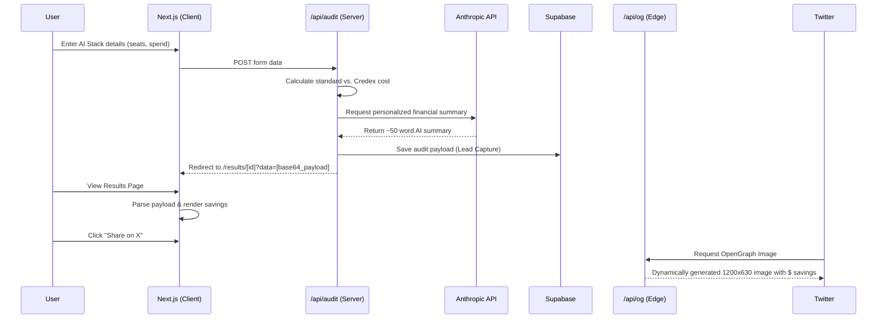

# System Architecture

## System Diagram

## Data Flow: How a user’s input becomes an audit result

1. **Input**: A startup founder visits the landing page and uses the multi-step `AuditWizard` (a client-side React component) to input their current number of developer seats (Cursor, ChatGPT, Claude) and estimated monthly API spend.
2. **Submission & Calculation**: The form submits this data to the Next.js API Route (`POST /api/audit`). The server deterministically calculates the standard cost and the discounted Credex cost using the hardcoded rules in `audit-engine.ts`.
3. **AI Summarization**: The API route makes a blocking call to the Anthropic API (Claude 3.5 Sonnet), passing the calculated savings to generate a personalized, ~50-word financial summary highlighting the strategic value of the saved capital.
4. **Persistence & Routing**: The combined payload (input, mathematical results, and AI summary) is either saved to Supabase (returning a unique ID) or, in the MVP local mode, encoded into a robust Base64 string. The server then redirects the user to `/results/[id]`.
5. **Rendering**: The dynamic Next.js Results page (`src/app/results/[id]/page.tsx`) decodes the payload, rendering the exact dollar savings metrics and the Claude-generated summary in the UI.
6. **Viral Loop**: When the page is requested by a social crawler (like Twitter/X), the metadata points to the `GET /api/og` route, which uses `@vercel/og` to dynamically render a custom OpenGraph image featuring the user's specific savings amount.

## Why I Chose This Stack

* **Next.js (App Router)**: The perfect framework for this project because it effortlessly combines interactive client-side components (the multi-step wizard) with powerful server-side capabilities necessary for dynamic SEO metadata and secure API keys (hiding the Anthropic API key).
* **Tailwind CSS + shadcn/ui**: Allowed me to rapidly build a high-polish, accessible, "enterprise light-mode" aesthetic without writing bloated custom CSS. The built-in animations (`tw-animate-css`) create a premium feel.
* **Anthropic API (Claude 3.5 Sonnet)**: Sonnet 3.5 is incredibly fast and excels at nuanced, professional, yet punchy financial copywriting, making it ideal for the summary generation.
* **@vercel/og**: Generating dynamic images using HTML/CSS inside Edge functions is significantly faster and easier to maintain than using headless browsers like Puppeteer.

## What I'd Change for 10k Audits/Day

If this viral loop took off and handled 10,000 audits per day, the current architecture would face bottlenecks primarily around third-party API limits and serverless execution times. I would change the following:

1. **Asynchronous AI Streaming**: Making a blocking API call to Anthropic before redirecting the user is dangerous at scale (timeouts, API rate limits). I would change the flow to immediately redirect the user to the results page, show the mathematical savings instantly, and use React Server Components (`ai` SDK) to **stream** the AI summary to the client in real-time.
2. **Strict Database Persistence**: I would remove the Base64 URL payload fallback and strictly write to/read from Supabase PostgreSQL. 10k audits/day means 10k highly valuable leads; we cannot risk data loss in the URL bar, and URLs have length limitations.
3. **Rate Limiting**: I would implement strict IP-based rate limiting on the `/api/audit` endpoint using Upstash Redis to prevent malicious actors from draining the Anthropic API budget.
4. **Edge Caching for OG Images**: I would add a `Cache-Control` header (e.g., `s-maxage=86400`) to the `/api/og` endpoint. If a result goes viral on Twitter, we want the Edge CDN to serve the cached image rather than re-rendering it for every view.
