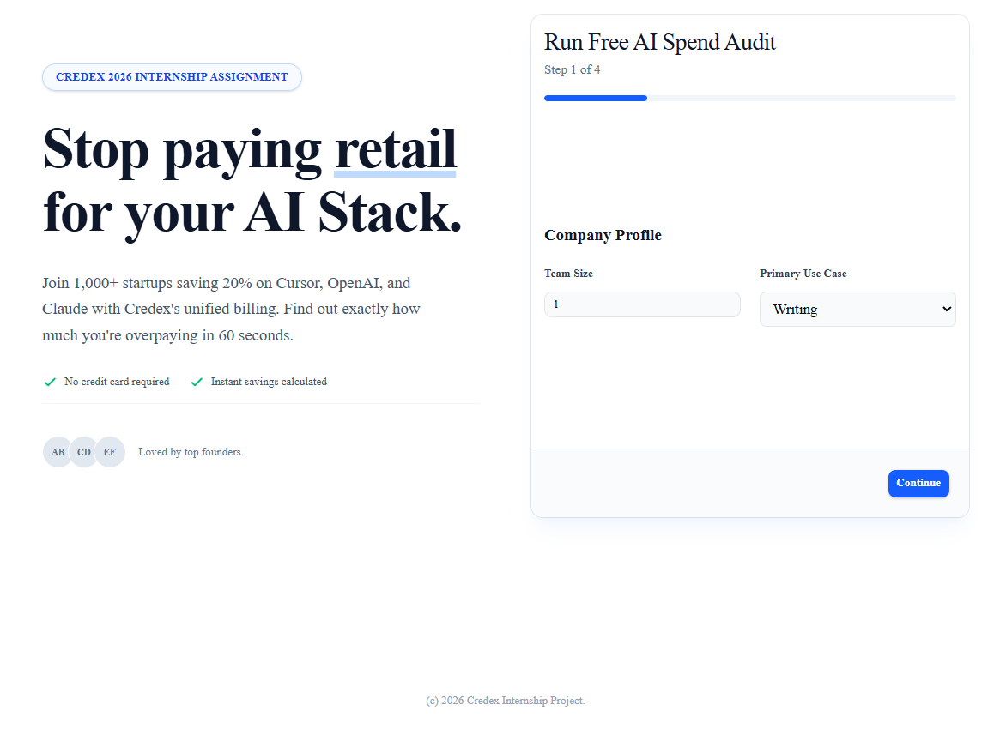
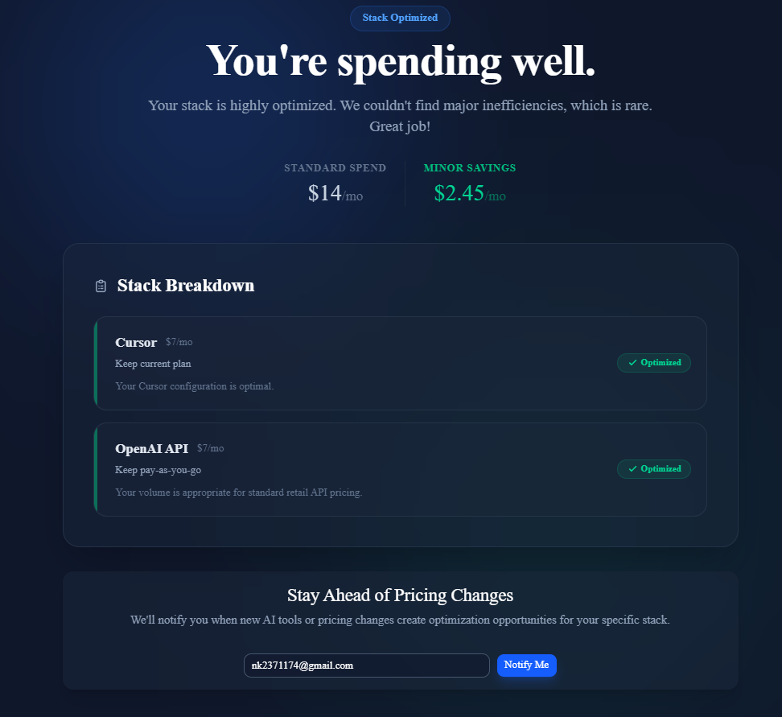

# Credex AI Spend Audit

The **AI Spend Audit** is a high-polish, Next.js lead-generation application built for Credex. It helps startup founders calculate exactly how much they are overpaying for AI developer seats (Cursor, Copilot) and API usage (OpenAI, Anthropic), and offers them a 15-20% discount through Credex's unified billing platform.

## Quick Start
1. Install dependencies: `npm install`
2. Create environment variables: `cp .env.local.example .env.local`
3. Add your Anthropic key: `ANTHROPIC_API_KEY=sk-ant-...`
4. Run locally: `npm run dev`
5. Test the suite: `npm test`

## 5 Trade-offs / Decisions Made

1. **Base64 Payload vs Database**: To ensure the MVP was immediately testable locally without requiring a complex Supabase configuration, I opted to serialize the audit results into a Base64 string passed in the URL. This ensures the shareable Results page works perfectly out of the box, though a DB would be used in production.
2. **Anthropic API (Claude) vs OpenAI**: I chose Claude 3.5 Sonnet over GPT-4o for the summary generation because Claude currently excels at nuanced, professional copywriting and adheres very strictly to tone constraints ("punchy financial advisor").
3. **`@vercel/og` over Puppeteer**: For the OpenGraph dynamic image generation (the Viral Loop), Vercel's `ImageResponse` was chosen over headless browsers because it executes near-instantly at the Edge, which is crucial for social media crawlers.
4. **Tailwind CSS + shadcn/ui**: This stack was selected because it allows rapid assembly of complex, accessible UI components (like the multi-step wizard) while adhering to a strict, customizable design system.
5. **Server-Side API Route vs Client-Side Generation**: The Anthropic API call is abstracted safely behind a Next.js API route (`/api/audit`) rather than executed on the client. This protects the API key and allows the server to simultaneously handle database insertion (lead capture) before redirecting the user.
